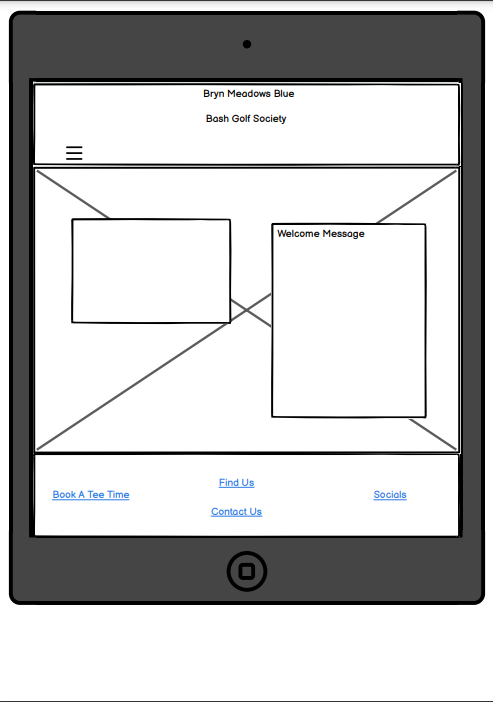
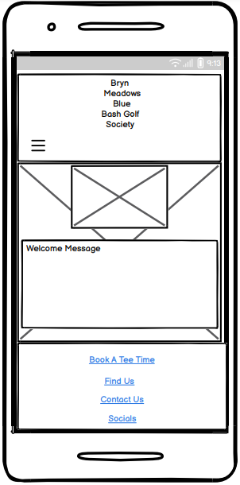
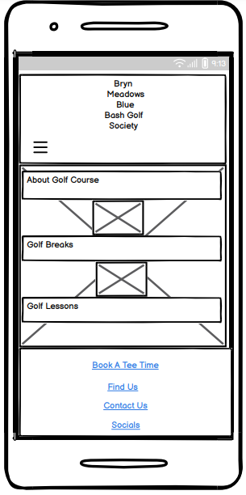

# **Bryn Meadows Blue Bash Golf Society**

Welcome to the Bryn Meadows Blue Bash Golf Society, a community of golf enthusiasts dedicated to enjoying the game and fostering camaraderie. Our society is all about bringing together players of different skill levels who share a passion for golf and a desire to have fun on the course.

<!--omit in Table of Contents-->

## **Table Of Contents**

- [**Bryn Meadows Blue Bash Golf Society**](#bryn-meadows-blue-bash-golf-society)
  - [**Table Of Contents**](#table-of-contents)
  - [**Project Scope**](#project-scope)
  - [**User-Centric Design**](#user-centric-design)
    - [**User Scenarios**](#user-scenarios)
      - [**First Time User Goals**](#first-time-user-goals)
      - [**Social Interaction Goals**](#social-interaction-goals)
      - [**Frequent Visitor Goals**](#frequent-visitor-goals)
  - [**Structure**](#structure)
  - [**Visual Elements**](#visual-elements)
    - [**Colour Palette**](#colour-palette)
      - [**Colour Psychology**](#colour-psychology)
      - [**Colour Usuage**](#colour-usuage)
    - [**Font-Choices**](#font-choices)
      - [**Primary Font: Montserrat**](#primary-font-montserrat)
      - [**Secondary Font: Lato**](#secondary-font-lato)
      - [**Accent Font: Great Vibes**](#accent-font-great-vibes)
      - [**Font Pairing Strategy**](#font-pairing-strategy)
      - [**Font Psychology**](#font-psychology)
    - [**Visual Assets**](#visual-assets)
      - [**Photography**](#photography)
      - [**Iconography**](#iconography)
      - [**Logo and Branding**](#logo-and-branding)
      - [**Layout and Design Elements**](#layout-and-design-elements)
      - [**Visual Consistency**](#visual-consistency)
    - [**BluePrints**](#blueprints)
    - [**Design Distinctions**](#design-distinctions)
      - [**Photography \& Images**](#photography--images)
      - [**Iconography**](#iconography-1)
      - [**Logo \& Branding**](#logo--branding)
      - [**Layout \& Design Elements**](#layout--design-elements)
      - [**Responsive**](#responsive)
      - [**Limitations**](#limitations)
      - [**Current Functionalities**](#current-functionalities)
      - [**Pending Features**](#pending-features)
    - [**Technologies**](#technologies)
    - [**Testing**](#testing)
      - [**User Story Testing**](#user-story-testing)

## **Project Scope**

The scope of this project encompasses the creation of a website, which serves as the designated solution for accomplishing the inaugural Milestone Project mandated by the Code Institute's Full Stack Developer program. The project scope extends to the utilization and application of acquired knowledge from modules such as HTML, CSS, and User-Centric Design. For an exhaustive compilation of the technologies harnessed for the project's execution, kindly consult the technologies section within this documentation.

## **User-Centric Design**

### **User Scenarios**

Here are some user scenarios for the "Bryn Meadows Blue Bash Golf Society" webpage, considering different types of users and their goals.

#### **First Time User Goals**

Jane is an avid golfer who just heard about the Bryn Meadows Blue Bash Golf Society from a friend. She visits the website to learn more and considers joining the society.

Jane wants to understand the benefits of the society, find information about upcoming events and tournaments, course and facilities and find contact information to inquire about membership.

> For first time users the webpage needs to have a straight forward comprehension of the primary purpose of the webpage and a chance to gain deeper insights in to the society. The webpage needs to have seamless navigation across the webpages, allowing users to conveniently explore its content and locate the information they seek. Finally, the webpage needs to be accessible from a mobile device with ease and clarity, ensuring that the content is presented in a user-friendly manner.

#### **Social Interaction Goals**

John, a sociable member, logs in to the website to connect with other golf society members.

John wants to participate in forum discussions about recent events and matches, find out if any members are looking for playing partners, share his own golfing experience and insights and access member profiles to get to know fellow golfers.

> The web page would need to implement a secure user authentication system to allow mwmbwrs to log into their accout. This can involve username/password authentication or even integration with social media accounts. The webpage would need a dedicated forum section where mebers can engage in discussions about recent events and matches. Each discussion thread should be categorized for easy navigation. The webpage will ensure the user interface is intuitive and easy to navigate, with clear labels, buttons, and menus so members can easily access the desired features. Also, ensure the entire structure is mobile-responsive to allow members to access the community and its features seamlessly from their mobile device.

#### **Frequent Visitor Goals**

Sarah frequently visits the golf course and uses the website to book tee times for her rounds.

Sarah wants to be able to view the tee time schedule for the next week, choose a suitable tee time slot and reserve the tee time and recieve a confirmation.

> The webpage design will require a dedicated section that displays the tee time schedule for the upcoming week minimum. The schedule should provide available tee time slots and the available number of slot foe each tee time. There will need to be a reservation page so the chosen tee time can be reserved with a confirmation email via email.

## **Structure**

Webpages will contain a navigation bar at the top of each page, allowing users to navigate to a new page for the desired content. This will be collapsable on smaller devices to accomodate the following user story.

> The webpage needs to have seamless navigation across the webpages, allowing users to conveniently explore its content and locate the information they seek. Finally, the webpage needs to be accessible from a mobile device with ease and clarity, ensuring that the content is presented in a user-friendly manner.

The homepage will feature an about section explain the goals and objectives of the society. This will be to facilitate the following user story.

> She visits the website to learn more and considers joining the society. Jane wants to understand the benefits of the society

There will be a golf course page explaining Bryn Meadows Golf Course and all of it's facilities and features. This is to accomodate the follwing user stories.

> Learn about the golf course and facilities

There will be a fixtures and results page to allow user to find information and upcoming and past events. This will fullfill the following user sotries.

> find information about upcoming events and tournaments,

The final page will be a link to an external source to allow users to view and book tee times. This will aid the following user stories. There will also be an additional link provided in the footer

> Sarah wants to be able to view the tee time schedule for the next week, choose a suitable tee time slot and reserve the tee time and recieve a confirmation.

The footer will be available across all pages and will contain a link to the Bryn Meadows Golf Course where the contact information and membership information is availble. This will fullfill the following user story.

> find contact information to inquire about membership.

The footer will also contain links to social media site. This will allow users to join social groups associated with Bryn Meadows Golf Course to allow users to communicate with members. This will accomodate the following user story.

> John wants to participate in forum discussions about recent events and matches, find out if any members are looking for playing partners, share his own golfing experience and insights and access member profiles to get to know fellow golfers.

Custom CSS and/or Bootstrap will be applied to ensure the website's responsiveness, utilizing media queries and/or the Bootstrap Grid system.

The layouts of all pages will adapt based on screen size, ensuring that content is visually appealing, images are correctly presented, and content is not compressed too tightly, resulting in illegibility.

## **Visual Elements**

### **Colour Palette**

The Colour palette chosen for the "Bryn Meadows Blue Bash Golf Society" webpage is carefully curated to reflect the spirit of the golfing community while maintaining a visually appealing and user-friendly interface. The colours have been selected to evoke a sense of elegance, vibrancy, and connection with the nauural beauty of the golf course.

| \*\*Primary colours |         |
| ------------------- | ------- |
| Deep Teal:          | #006D77 |
| Grass Green:        | #3EB489 |
| Cloud White:        | #FFFFFF |

| **Accent Colours** |         |
| ------------------ | ------- |
| Golden Sun:        | #FFD166 |
| sky Blue:          | #93C6EO |

#### **Colour Psychology**

- **Deap Teal** conveys stability, trustworthiness, and a sense of depth, aligning with the golf society's reliability and commitment to the sport.
- **Grass Green** symbollises growth, harmony, and a connection to nature, reflecting the golfing experience and the beautiful golf course.
- **Cloud White** cultivates an atmosphere of clarity. professionalism, adn tranquility, enhancing the overall user experience and aligning with the society's values.
- **Golden Sun** adds a touch of warmth, optimism, and energy, enhancing the overall inviting atmosphere.
- **Sky Blue** elicits a feeling of tranquility and openness, enhancing the user's comfort while navigating the webpage.

#### **Colour Usuage**

- **Deep Teal** serves as the primary background colour providing a solid and grounding base for the webpage.
- **Grass Green** is used sparingly to highlight important elements, such as buttons, call-to-action sections, and active links.
- **Cloud White** is employed for text and content backgrounds, ensuring readability and a clean, crisp appearance.
- **Golden Sun** is used for speacial highlights and interactive elements that need to draw attention.
- **Sky Blue** complements the colour scheme and is utilised for subtle accents that add a touch of freshness.

The colour palette has been chosen with careful consideration for accessibility, ensuring that text remains easily readable against various background colours. This cohesive palette enhanves the user experience and reinforces the visual identit of the "Bryn Meadows Blue Bash Golf Society" webpage.

### **Font-Choices**

The selection of fonts for the "Bryn Meadows Blue Bash Golf Society" webpage plays a pivotal role in establishing a cohesive and visually appealing brand identity. The chosen fonts have been thoughtfully considered to ensure optimal readability, complement the website's design, and convey the society's essence.

#### **Primary Font: Montserrat**

- **Typeface:** Sans-serif
- **Description:** Montserrat offers a modern and elegant appearance, making it a suitable choice for headings, titles, and prominent text. Its clean lines and versatility align well with the golf society's professional and approachable image.

#### **Secondary Font: Lato**

- **Typeface:** sans-serif
- **Description** Lato is a highly legible font that works excellently for body text, paragraphs, and longer content. Its balanced proportions and comfortable readability enhances user experience while navigating the website.

#### **Accent Font: Great Vibes**

- **Typeface:** Script
- **Description:** Great Vibes adds a touch of elegance and uniqueness to special elements such as quotes, featured events, or headings requiring a more decorative apperance. It injects personality while maintaining a sense of sophistication.

#### **Font Pairing Strategy**

The pairing of Montserrat and Lato ensures a harmonious blend of modernity and readability. Montserrat's geometric elegance contrasts well with Lato's rounded shapes, creating a visually appealing hierarchy that guides users through the content seamlessly.

#### **Font Psychology**

- **Montserrat:** It's clean lines and structured design convey professionalism and reliability, aligning with the golf society's commitment to excellence and organisation.
- **Lato:** The balanced and approachable nature of Lato fosters a sense of inclusivity and openness, reflecting the friendly and welcoming atmosphere of the society.
- **Great Vibes** The use of Great Vibes for accent elements adds a touch of elegance and sophistication, enhancing the user's experience and capturing the essence of special occasions and events.

The combination of these fonts contributes to the overall aesthetic and user experience of the "Bryn Meadows Blue Bash Golf Society" webpage, ensuring that content in not only readable but also visually engaging.

### **Visual Assets**

The visual assets used on the "Bryn Meadows Blue Bash Golf Society" webpage have been thoughtfully curated to enhance the user experience, convey the society's identity, and provide a visually engaging presentation of content.

#### **Photography**

High-quality photographs capture the essence of the golfing experience and the natural beauty of the golf course. These images are strategically placed throughout the website to provide visual context and evoke a sense of connection with the golf society's offerings.

#### **Iconography**

A collection of carefully selected icons has been integrated to enhance navigation, highlight features, and make the user interface more intuitive. These icons are utilised in menus, buttons, and sections to visually communicate information efficently.

#### **Logo and Branding**

The golf society's logo serves as a corner stone of its visual identity. It is prominently displayed on the website to establish brand recognition and create a consistent visual presence. The logo's colours and design align with the overall aesthetics of the site.

#### **Layout and Design Elements**

The layout of the website incorporates grids, sections, and visual hierarchy to guide users seamlessly through the content. Consistent design elements such as buttons, headers, and backgrounds contribute to a visually pleasing and user-friendly interface.

#### **Visual Consistency**

Maintaining visual consistency across the webpage ensures a unified and coherent user experience. The careful integration of photography, iconography, branding, typography, and colours creates an enviroment that resonates with the users and reinforces the golf society's brand identity.

### **BluePrints**

Home Page Computer

Golf Course Page Computer

Fixture Page Computer

Home Page Tablet

Golf Course Page tablet

Fixtures Page Tablet

Home Page Smartphone

Golf Course Page Smartphone

Fixtures Page Smartphone

### **Design Distinctions**

#### **Photography & Images**

Photography and Images play a pivotal role in my web page's design. I incorporated a diverse range of photographs and images, carefully selected to align with my project's narrative and branding. These visuals go beyond aesthetics; they are instrumental in conveying my story to the audience and reinforcing my brand identity. The high quality and resolution of these images not only ensure a visually appealing presentation but also enhance user engagement. By integrating these visuals thoughtfully, i aim to create a captivating and immersive user experience that resonates with our project's core message and values.

#### **Iconography**

Iconography is a fundamental component of my web page's design, serving to enhance user navigation and content comprehension. utilizing a variety of icons, each meticulously chosen for its specific purpose in improving the user experience. These icons act as visual cues, aiding users in quickly identifying and interacting with different features and functions on my page. To maintain visual consistency and align with my project's theme. Through these thoughtful icon choices, I aim to streamline user interactions and make content consumption more accessible and user-friendly.

#### **Logo & Branding**

My project's logo plays a pivotal role in establishing the brand identity and creating a lasting visual impression. The logo's design incorporates carefully selected colors and imagery that resonate with the essence of my project. Placed prominently within the web page, it serves as a cornerstone of our branding efforts, ensuring that users readily recognize and associate it with my project.

#### **Layout & Design Elements**

My web page features a carefully crafted layout that ensures optimal user experience. Content is strategically placed to guide users seamlessly through the page, with headers and footers providing clear navigation and context. I have employed a responsive grid system to adapt the layout to different screen sizes, maintaining visual appeal and readability across devices. Design elements, including dividers and decorative elements, enhance the overall aesthetics and organization of our content. These elements not only improve visual appeal but also contribute to a consistent and cohesive user experience. By thoughtfully integrating layout and design elements, we've created an environment that resonates with users, reinforcing our project's visual identity and making the web page both engaging and accessible.

#### **Responsive**

The Bryn Meadows Blue Bash Golf Society's website has been meticulously designed to offer a responsive and user-friendly experience on all devices. Whether you're accessing the site from a desktop computer, laptop, tablet, or smartphone, the web page seamlessly adapts to various screen sizes and resolutions. This responsiveness ensures that users can enjoy the same high-quality content, stunning visuals, and intuitive navigation, regardless of the device they choose. From exploring the golf course details to booking tee times or accessing fixtures, the website's layout and design elements dynamically adjust to provide optimal readability and usability, making it accessible to a wide range of audiences and enhancing the overall user experience.

#### **Limitations**

The contact form on the Bryn Meadows Blue Bash Golf Society website primarily relies on Bootstrap (utilizing JavaScript and JQuery) for its functionality. However, it's important to note that due to the absence of additional JavaScript functionality beyond Bootstrap, the contact form does not have the capability to store submitted data or send email requests. While Bootstrap facilitates the display and interaction of the contact form through a modal interface, it lacks the backend processes required for data storage and email transmission. Therefore, users should be aware that any information entered into the contact form may not be stored or result in email notifications, as these advanced functionalities typically necessitate server-side scripting or backend development, which is not implemented in this specific form.

#### **Current Functionalities**

- **Contact Form** :- The functionality of the contact form on the Bryn Meadows Blue Bash Golf Society website allows visitors to interact with the website and send inquiries or messages to the website administrators or customer support team.
- **Booking Button** :- The link button to the booking form on the Bryn Meadows Blue Bash Golf Society website serves as a direct pathway for users to access and book tee times or other golf-related services.
- **GolfBreaks, Golf Lessons & Golf Facilities Buttons** :- The link buttons to "Golf Breaks," "Golf Lessons," and "Golf Facilities" on the Bryn Meadows Blue Bash Golf Society website provide specific functionalities tailored to different aspects of the golfing experience.
- **Find Us Button** :- The "Find Us" link on the Bryn Meadows Blue Bash Golf Society website provides functionality related to locating the physical address and geographical position of the golf course.
- **Socials Buttons** :- The social links on the Bryn Meadows Blue Bash Golf Society website provide functionality related to connecting with the golf society and its community through various social media platforms.

#### **Pending Features** 

- **Members Login** :- The intention of implementing a members login function is to enhance the user experience and provide a personalized and secure environment for registered members of the Bryn Meadows Blue Bash Golf Society website.
- **Scorecard & Handicapp Tracker** :- Integrate a digital scorecard system that allows golfers to record their scores, track their handicaps, and view historical performance data.
- **Golf Coursr Maps and Hole Overviews** :- Provide detailed maps and hole-by-hole overviews of the golf course, helping golfers plan their rounds and understand course layout.

### **Technologies**

- **HTML** :- HTML serves as the primary language utilised to construct the websites fundamental structure.
- **CSS** :- This projectemploys custom-written CSS to design and style the website.
- **Bootstrap v5.2.3** :- Throughout this project, the Bootstrap framework is utilised for both layout structuring and styling purposes.
- **Fontawesome** :- Font Awesom icons are employed for the social media links found within the website's navigation and footer sections.
- **Google Fonts** :- The project utilises Google Fonts to import the Montserrat and Lato fonts across the website, with Sans Serrif as the default.
- **GitHub** :- GitHub serves as the hosting platform for storing the source cose of the website, while Git Pages is employed for deploying the live site.
- **Git** :- Git serves as the version control software for commiting and pushing code to the GitHub repository, which stores the source code.
- **Google Chrome Developer Tools** :- The built-in developer tools of Google Chrome are utilised for inspecting page elements, aiding in debugging site layout issues, and experimenting with various CSS styles.
- **balsamiq wireframes** :- This tool was employed to generate wireframes during the "The Skeleton Phase" of UX design.
- **WebP Converter** :- This was employed to convert JPG files to WebP files for better loading times.
- **Google Chromes Lighthouse** :- Google Chrome's Lighthouse was used to evaluate accessibility.
- **W3C HTML Markup Validator** :- This was employed for HTML code validation.
- **W3C Jigsaw CSS Validator** :- This was utilised to valifate CSS Code.

### **Testing**

#### **User Story Testing**

